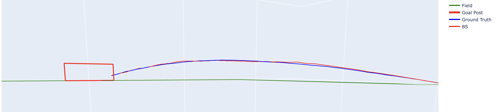
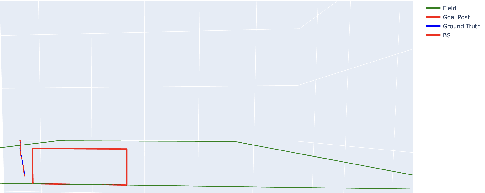
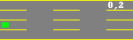
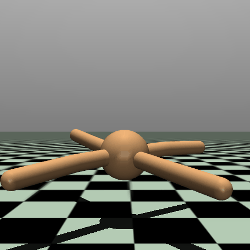

# COL778-Principles-of-Autonomous-Systems

## Assignment 1: State Estimation

**Figure:** Ground Truth and Estimated Trajectories (using Extended Kalman Filter) in a Football field. Ball doesn't land inside the goal!

## Assignment 2: Q-Learning

  
  
  

**Figure:** Single Episode — `total distance` reward, `3-level` discretization in `total distance` reward, `overtakes` reward

## Assignment 3: Imitation Learning

  
  

**Figure:** Single Episode — `Hopper-v4` agent, `Ant-v4` agent

## Assignment 4: Paper presentation
[`Learning to Generalize Kinematic Models to Novel Objects,  Abbatematteo et. al.`](http://proceedings.mlr.press/v100/abbatematteo20a/abbatematteo20a.pdf)